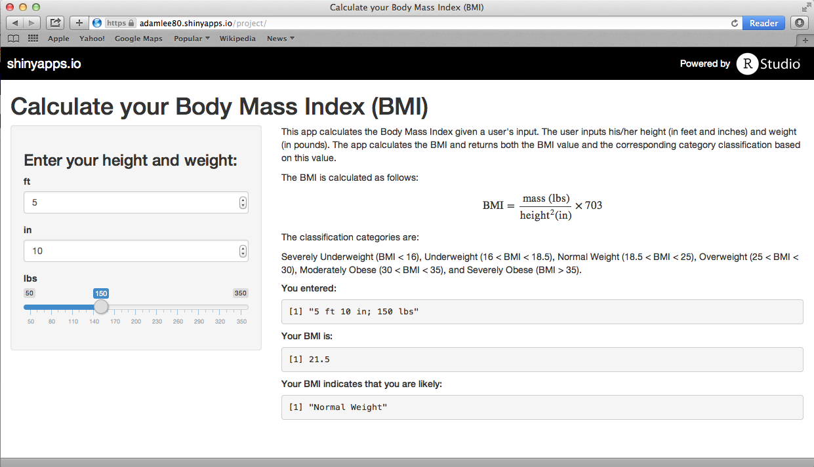

## The Boby Mass Index

<h3>Ever wonder how you rank in terms of body fat percentage level?</h3> 


- The Body Mass Index (BMI) is a simple way of measuring body fat percentage
- It was created in 1972 by <a href="http://en.wikipedia.org/wiki/Ancel_Keys">Ancel Keys</a> and has tood the test of time
- It is easy to calculate; all that's needed is one's: 
      - height and
      - weight
- It is easy to interpret; it is a single-valued measure


--- .class #id 

## The BMI Formula  

In the U.S. customary system the BMI is calculated with the following formula:  
$$\mbox{BMI} = \frac{\mbox{Mass}}{\mbox{Height}^2} \times 703$$
where Mass is the weight in lbs, and Height is in inches.  
The calculation can be implemented in R as follows:
```{r bmi_function}
bmi <- function(f,i,w){
            round(w / (f * 12 + i)^2 * 703,1)
      }
# test case: 5 feet 10 inches, 150 lbs
bmi(5,10,150)
```

--- .class #id

## A Simple yet Awesome App

- Simply input your Height and Weight  
- It will tell you your BMI  
- It will even tell you if you are underweight, within normal range, or obese  

<div align="left">

<div>Screenshot of the BMI app.</div>
</div>


--- .class #id

## See it in Action

Check out the awesome BMI app at:  
https://adamlee80.shinyapps.io/project/

Use the following chart to see how you compare to the general population:
<div align="left">

<div><tiny>Source: wikipedia.org</tiny></div>
</div>  

For more detailed information about BMI check it out <a href="http://en.wikipedia.org/wiki/Body_mass_index">here</a>